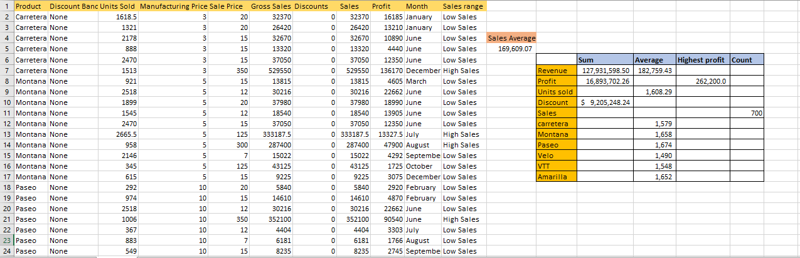

# EXCEL FORMULAS AND FUNCTIONS
- **Introduction**
- For this task,A Sales Dataset was provided, with which will be used to recover an impactful and useful analysis at the end of the task.
# **Concepts Incorperated**
AVERAGE FUNCTION, MAX FUNCTION, COUNT FUNCTION,COUNTIF FUNCTION,SUM FUNCTION AND SUMIF FUNCTION
# **Problem Statement**
- The task seeks solutions to the problems of getting the, 
# 1.Total profit and revenue generated from the given datasets,
- To get the total profit and revenue, the "Sum Function" is used and it gives 127,931,599
# 2.The second problem is to get the Average revenue and units sold for every order,
- To get that,the "Average function" is used and it gives 182759.4264 for the Average revenue while 1608.294286 for the Average units sold.
# 3.The third problem is to get the "Total discounts given in $,
- To get this,the "Sum Function" is used and it gives $9,205,248.24.
# 4.The fourth problem is to get the "Total number of sales recorded",
- To get this, the "Count Function' is used and it gives 700.
# 5.The fifth problem is to get the "Highest profit generated",
- to get this, the "Max Function" is used and it gives 262,200.
# 6.The sixth problem is to create another column with label "Sales range", which asks to return "High Sales" if the sales value is above average,otherwise "Low Sales,
- To get this, the "IF Function is used.
- Below is the snipshot showing the table and the new created "sales range" column.
- 
- ---
# Conclusion
Solution or Answers to the above problems were provided for, using the basic Excel Formulas and Functions. 
